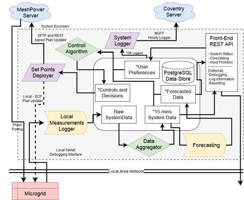

# Heed-Microcontroller
Repository holding the components of the HEED Controller  that manage the energy consumption on the MicroGrid based on input from the interface.

Main Driver:
* Forecasting system and Control algorithm needs to be seamlessly replaceable with different iterations (propose an internal messaging system, service based or Redis information share

Control Method:
* Requires current system power consumption and/or forecasting data
* Requires input from users from the board 
* Has a hierarchical priority system where the priority levels are set by the community through the interface.

## Overview

The overview of hte Microgrid architecture can be seen in the image below. 



Slides detailing the architecture, concept and methods of the Microgrid Deployment are in the [docs](docs) as [Microgrid_Presentation_Slides.pdf](docs/Microgrid%20Controller%20-%20HEED.pdf).

# Setup
The repository comes with a [Makefile](Makefile) that will install all of the python libraries required to run the scripts. Thescript assumes you have python and pip installed. The variations of the makefile are:
```
make install                        Install all of the python requirements for running any part of the code
make test                           UnitTests for all the deployment modules
make docker_build:                  Building the docker containers that can be used to deploy the microcontroller and interface
make docker_run                     Deploying the docker containers that were built using docker_build 
```

# Usage and Examples

## Notebooks and testing

There are several notebook that allow certain features of the microgrid to be tested and deployed.

* [Component Examples](notebooks/Component%20Examples.ipynb) showcases how each component of the Microgrid controller is run and what values it pushes to the logs.
* [Simulation Environment](notebooks/Simulation_Environment_Example.ipynb) showcases how the sample data based simulation environment module works.
* [Control Algorithm Evaluation](notebooks/Control%20Algorithm%20Evaluation.ipynb) Showcases how the two control methods work and compares their decision at the end.
* [Device Forecasting SARMIAX](notebooks/Device%20Forecasting%20SARIMAX.ipynb) contains code that was used to find the best parameters and test the SARIMAX based load forcasting.
* [PV Forecasting](notebooks/PV%20Forecast.ipynb) show how the PV forecasting is done along with comparisons to historic dates. This is based on the python pvlib library and uses a clear sky model.
* [GA Example](notebooks/GA_Examples.ipynb) contains an example of how to run the GA code.

## Deployment - Non Docker
The microgrid controller can be deployed in any environment that has the approriate libraries and python environment. The code also requires the user to set up a PostgreSQL server and add any config parameters into the *runner_config.json* by copying and editing the [runner_config_sample.json](config/runner_config_sample.json).

The main runner is in the [Runner.py](deployment/Runner.py) that deployes the forecasting, aggregation, controll action, local and remote logging. 

## Deployment - Docker
The docker containers can be found under the [docker](docker) directory.

* [Core](docker/core) contains the core libraries so that rebuilding the runner is faster.
* [Deployment](docker/deployment) contains the runner for the controller. It uses the container created in the core.
* [Interface](docker/interface) contains the Microgrid Web interface that can be used to set priorities and monitor the system.

## Web Control Interface

Displays microgrid status in a HTML file, allowing selection of metrics and indicators for important metrics e.g. battery state of charge. Allows prioritisation of locations/device-types. This is designed to work locally i.e. as a "file://" URL, but will also function if files are served by a web server.

### Configuration

There are a number of settings that are designed to be changed via the conf.js file. These are commented and should be self-explanatory.

The `API` variable will require configuration prior to deployment to point at the live API(s). It is ordered based on preferred API. If you only need one, you can remove all elements bar one.

`METRIC_POLL_RATE` has been set to 5s primarily for testing. You may wish to throttle this back to e.g. 10s for deployment.

The LCD-style display of metric values has been sized to support 4 characters/digits. If display of larger values is required, you can adjust the CSS for width in span.metric in the monitor.css file.


The address to which the API makes request can be set in the [conf.js](Web_UI/static/conf.js) file, where the possible externally facing addresses should be ordered hierarchically. For a purely local deployment this can be left to localhost.
### Internationalisation

Internationalisation is done via the i8n.js file. The variable TRANS holds translations for supported languages (English, Kinyarwanda). Additional languages may be added by adding another top-level dictionary to TRANS, and a "_lang" key-value pair. _lang is used to populate the language selection box. Any modifications will require a page reload.

If a non-English translation is missing, the UI will display the text prefaced by country code in brackets e.g.  
(rw) Priority Level.


# Back-End API Description

**Reading the System State V1**
----
  Returns the current charging and battery state, parameters of total consumption and predicted consumption vs available.

* **URL**

  /read_state/v1

* **Method:**

  `GET`
  
*  **URL Params**

   None

* **Data Params**

  None

* **Success Response:**

  * **Code:** 200 <br />
    **Content:** 
    ```json
        {
          "battery state of charge (percentage)": 80.7,
          "battery energy available (kwh)": 6.45,
          "system state (charging)": true,
          "power consumption (kw)": 0.5,
          "solar pv power generation (kw)": 1.2,
          "solar pv energy generation 24h (kwh)": 6.7,
          "solar pv energy generation 30days (kwh)": 191.4,
          "energy consumption 24h (kwh)": 3.7,
          "energy consumption 30days (kwh)": 90.4
        }
    ```
 
* **Error Response:**

  * **Code:** 404 NOT FOUND <br />
    **Content:** `{"error" : "No Data is currently available."}`

* **Sample Call:**

  ```javascript
     $.ajax({ url: "/read_state/v1",
    dataType: "json",
    type : "GET",
    success : function(r) {
      console.log(r);
    } 
    });
  ```

**Reading the System State V2**
----
  Returns the current charging and battery state, parameters of total consumption and predicted consumption vs available.

* **URL**

  /read_state/v2

* **Method:**

  `GET`
  
*  **URL Params**

   None

* **Data Params**

  None

* **Success Response:**

  * **Code:** 200 <br />
    **Content:** 
    ```json
    { 
       "system_state":[
            [80.7,"%","Battery State of Charge"],
            [6.45,"kWh","Available Energy"],
            [true,"","System State - Charging"],
            [0.5,"kW","Current Power Consumption"],
            [1.2,"kW","Solar PV Power Generation"],
            [6.7,"kWh","Solar PV Energy Generated Today"],
            [191.4,"kWh","Solar PV Energy Generated This Month"],
            [3.7,"kWh","Total Energy Consumed Today"],
            [90.4,"kWh","Total Energy Consumed this Month"]
        ],
       "priorities": {
            "0": ["Nursery 1 - Lights","lights"],
            "1": ["Nursery 2 - Lights","lights"],
            "2": ["Playground - Lights","lights"],
            "3": ["Nursery 1 - Sockets","sockets"],
            "4": ["Nursery 2 - Sockets","sockets"],
            "5": ["Playground - Sockets","sockets"]
        }
    }
    
    ```
 
* **Error Response:**

  * **Code:** 404 NOT FOUND <br />
    **Content:** `{"error" : "No Data is currently available."}`

* **Sample Call:**

  ```javascript
     $.ajax({ url: "/read_state/v2",
    dataType: "json",
    type : "GET",
    success : function(r) {
      console.log(r);
    } 
    });
  ```


**Sending priority Changes**
----
  Tells the system if there were any priority changes envolved.

* **URL**

  /update_priorities

* **Method:**

  `POST`
  
*  **URL Params**

   None

* **Data Params**

  * **Content-Type: application/json**
  ```json
    {
      "priorities": {
        "0": "Nursery 1 - Lights",
        "1": "Nursery 2 - Lights",
        "2": "Playground - Lights",
        "3": "Nursery 1 - Sockets",
        "4": "Nursery 2 - Sockets",
        "5": "Playground - Sockets"
      }
    }
    ```
* **Success Response:**

* **Code:** 200 <br />
  **Content:** `{"success": "Data Submitted Successfully."}`
 
* **Error Response:**

  * **Code:** 404 NOT FOUND <br />
    **Content:** `{"error": "Somethign went wrong with the submission."}`

* **Sample Call:**

  ```javascript
      $.ajax({ url: "/update_priorities",
      type: "POST",
      data: JSON.stringify({"priorities":{"1": "Nursery 1 - Lights","2": "Nursery 2 - Lights","3": "Playground - Lights","4": "Nursery 1 - Sockets","5": "Nursery 2 - Sockets","6": "Playground - Sockets"}}),
      dataType: "json",
      contentType: "application/json; charset=utf-8",
      success : function(r) {
        console.log(r);
      } 
      });
    ```

## Misc and Information

### Simulation Environment and Control

The [simulation evaluation](simulation_evaluation) directory contains files that can be used to simulate how the microgrid runs. It also contains code for GA and utility based control as well as a Space shared reference controller.

* [controller_offline.py](simulation_evaluation/controller_offline.py) uses the available testing data from August [ref](data/microgrid_processed_august.csv) to generate sample days that can be optimised. It also allows the battery and pv panels to be scaled.
* [microgrid_ga.py](simulation_evaluation/microgrid_ga.py) is the GA option for control.
* [controller_offline.py](simulation_evaluation/controller_offline.py) contains the offline version of the deployed controller. 

### Initialisation
The initialisation script from [initialise_db.py](initialisation/initialise_db.py) can create the required database and tables to operate the microgrid.
The script from [populate_historic.py](initialisation/populate_historic.py) will also fill the tables with raw data spanning 24h in the past.

### Mock Services
To test the microgrid controller without a real Microgrid, the telnet mock service from [Telnet_Dummy.py](mock_services/Telnet_Dummy.py) can be used to run a telnet server that porvides fake data.

### Data and testing files
Sample data from August 2019 can be found in the [data](data) folder as the [microgrid_processed_august.csv](data/microgrid_processed_august.csv) file.
Test inputs and outputs for the unit testing are in the same folder as [test_input.csv](data/test_input.csv) [test_output.csv](data/test_output.csv).

### Unit tests
The unittests can be found under the [test](tests) directory. THe business logic of the deployed code is tested for the [Battery](tests/test_Battery.py), [Control Enactor](tests/test_Control_Enactor.py), [Data Retreiver](tests/test_Data_Retreiver.py) and [Forecaster V2](tests/test_Forecaster_v2.py).

## Related Research and Publications 

 - To be followed

##Contributors and Development

* WebUI Developed by [Scene](https://scene.communitygithub) and [Iain Hogg](https://github.com/iain-dev)
* Documentation and support from [MeshPower](https://www.meshpower.co.uk/) on integrating with their system.
* Microgrid Controller Developed at Coventry University by the Cogentee Group

## License
[MIT License](LICENSE)